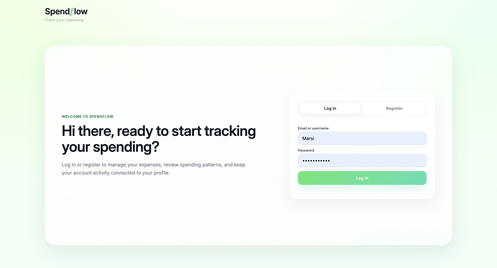
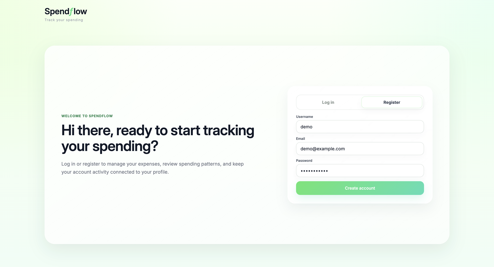
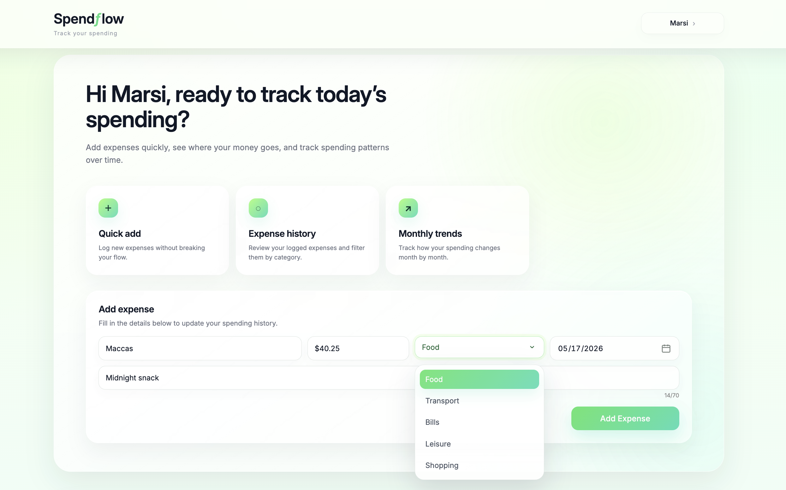
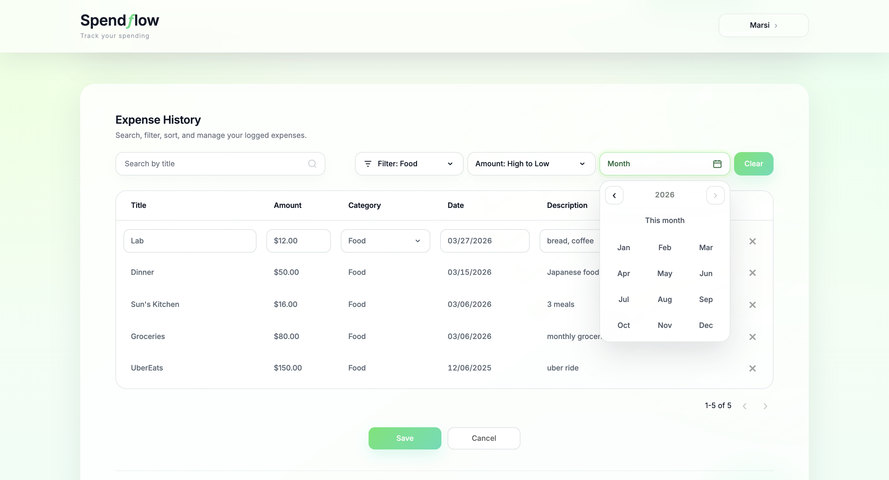
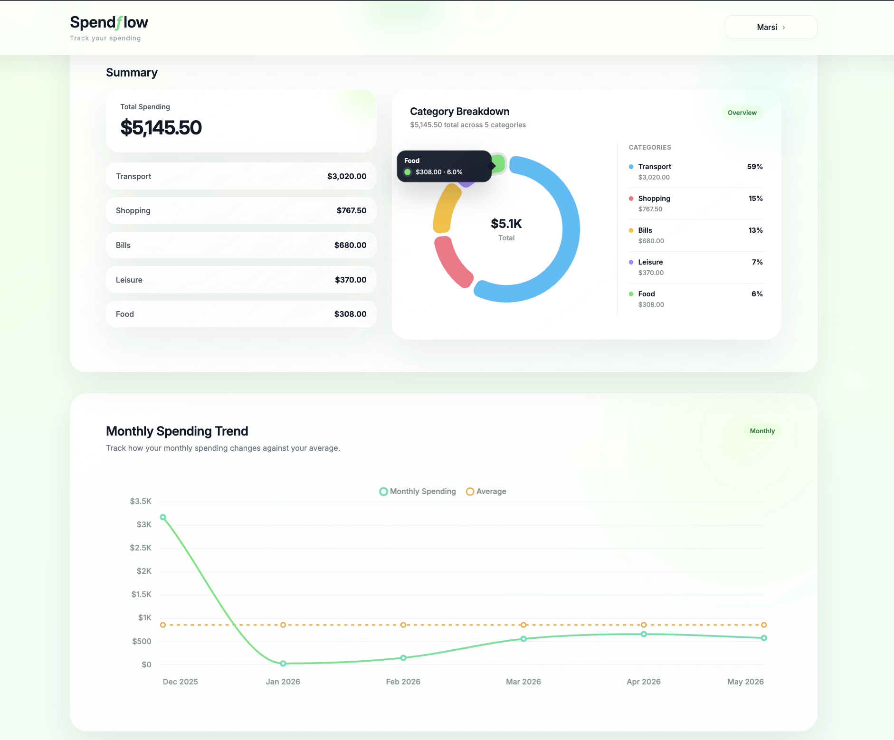
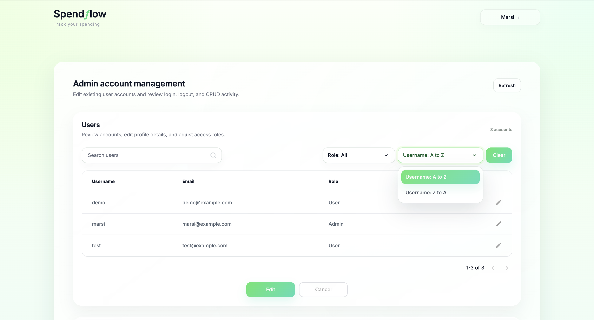
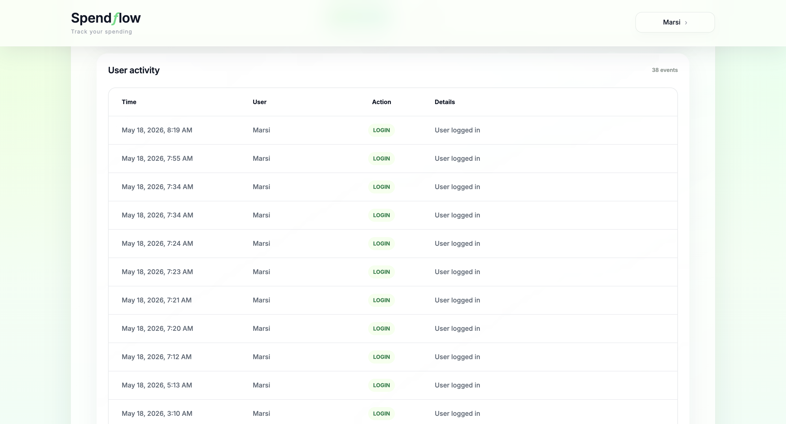
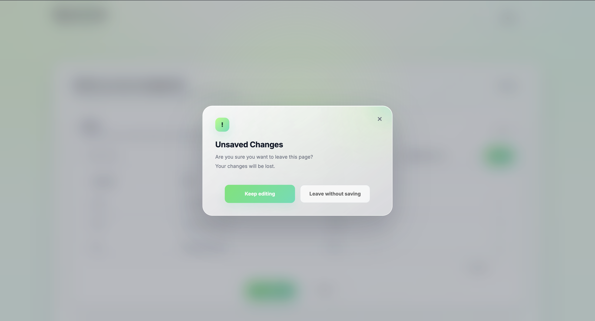

# Spendflow Expense Tracker

Spendflow is a single-page expense tracking web application that helps users record, manage, and review their spending history. It supports login and registration, database-backed expense CRUD operations, admin user management, user activity tracking, dynamic filtering and sorting, editable tables, category summaries, and monthly spending trends.

## Problem It Solves

Many people track expenses in spreadsheets or scattered notes, which makes it harder to review patterns, edit past entries, and understand where money is going. Spendflow provides a cleaner workflow for logging expenses, reviewing spending by category and month, and managing user accounts from one interface.

## Technical Stack

- **Frontend:** HTML, CSS, JavaScript, and React/Vite
- **Styling:** Custom CSS
- **Backend:** Node.js + Express
- **Database:** MySQL
- **Authentication:** JWT-based login with bcrypt password hashing
- **Charts:** Chart.js
- **Routing / Data Flow:** REST API endpoints between frontend and backend
- **Database Export:** `expense_tracker.sql`

## Frontend Implementation Note

The polished dashboard interface is implemented in the root `index.html`, `script.js`, and `style.css` files. The Express backend serves those files directly for the integrated app at `http://localhost:3000`.

The `client/` folder contains a React/Vite compatibility bridge that imports the same root HTML, CSS, and JavaScript into a React entry point. This allows the current UI to run through React while preserving the existing polished dashboard behaviour. A future refactor could break the interface into fully native React components.

## UI Design and Visual Style

Spendflow uses a modern dashboard-style interface designed around clarity, consistency, and low-friction expense tracking. The visual system uses soft green accents, glass-like surfaces, rounded components, and subtle shadows to create a calm financial tracking experience.

### Design Principles

The interface is guided by four design principles:

- **Clarity:** Expense information, user activity, table actions, and chart insights should be easy to scan.
- **Consistency:** Forms, dropdowns, filters, tooltips, buttons, dialogs, and cards use shared styling patterns.
- **Soft visual hierarchy:** Headings, cards, active states, and chart colours guide attention without overwhelming the page.
- **Feedback-driven interaction:** Toasts, focus states, row highlights, dialogs, and edit states help users understand when an action has been completed or when a control is active.

### Colour System

Spendflow uses a green and mint colour system to suggest money flow, progress, and positive financial tracking. The palette combines bright accent colours with pale green backgrounds and dark neutral text for readability.

| Token / Use | Colour | Usage |
| --- | --- | --- |
| Primary Green | `#4DDE83` | Main brand accent, active states, highlights, and selected UI elements |
| Mint Accent | `#48DDB6` | Gradients, focus borders, chart accents, and secondary interactive states |
| Lime Accent | `#A8FF78` | Background glows, focus highlights, and soft decorative accents |
| Primary Gradient | `#58E66F` to `#48DDB6` | Primary buttons, active filters, selected dropdown items, and major call-to-action states |
| Hover Gradient | `#64ED78` to `#55E8C2` | Button hover states and stronger interaction feedback |
| Main Text | `#111827` | Headings, important labels, totals, and active table text |
| Muted Text | `#7B857F` | Secondary labels and supporting UI text |
| Soft Text | `#9CA3AF` | Placeholder text, inactive states, helper text, and subtle metadata |
| Page Background | `#FBFFF8`, `#F4FFF0`, `#EFFDF5` | Soft green page gradient and dashboard background tones |

Chart colours use distinct category-based accents so users can quickly compare spending areas, while the monthly trend chart uses a green spending line and a contrasting orange average line for clearer comparison.

### Typography

Spendflow uses **Inter** as the primary typeface because it is clean, modern, and readable in dashboard, form, table, and chart interfaces.

Headings use heavier font weights to establish structure, while body text, table data, labels, and descriptions use lighter weights so the interface feels balanced and easy to scan.

### Layout and Components

The application is structured as a single-page interface with authenticated and admin views:

- **Login / Register screen:** A glass-style authentication screen that hides dashboard content until the user signs in.
- **Add Expense section:** A compact dashboard form for quickly adding a new expense.
- **Expense History section:** A searchable and editable table with filters, sorting, month filtering, pagination, and row actions.
- **Summary and Monthly Trend sections:** Chart-based views for reviewing spending by category and month.
- **Admin User Profile section:** An admin-only view for editing user accounts and reviewing user activity.

The component system uses rounded cards, soft shadows, translucent borders, glass-like backgrounds, and consistent spacing. Custom dropdowns, the date picker, toast messages, tooltips, buttons, filters, confirmation dialogs, and chart containers follow the same visual language so the app feels cohesive.

### Interaction and State Design

Spendflow uses clear interaction states so users can understand what is clickable, selected, editable, invalid, or completed.

| State | Behaviour |
| --- | --- |
| Default | Inputs and cards use soft white surfaces with subtle borders |
| Hover | Buttons, dropdown options, and controls become slightly brighter or darker |
| Focus | Inputs use a mint border and soft green glow |
| Active / Selected | Filters, dropdown options, and selected dates use the primary green gradient |
| Edit Mode | Table cells show stronger focus states only while editing is enabled |
| Invalid Values | Invalid editable table cells show a red border and an error toast |
| Success Feedback | Toast notifications confirm actions such as adding, saving, deleting, logging in, or logging out |
| New Row Feedback | Newly added expenses are highlighted and the table jumps to the correct page |
| Confirmation Dialogs | Unsaved-change and remove-user warnings use a consistent modal card with explicit actions |

The category pie chart uses a tooltip positioned outside the centre label so values remain readable. The monthly trend chart shows visible points on spending and average lines so hoverable values are easier to discover.

### Responsiveness and Accessibility Considerations

The layout is designed to adapt across screen sizes. Filter controls wrap on smaller screens, chart sections stack when needed, and tables use ellipsis and horizontal scrolling to prevent text from being cut off on narrow viewports.

Accessibility considerations include:

- Clear focus states for keyboard navigation
- `aria-label` usage for icon-only controls
- Hidden helper labels for controls such as the calendar trigger
- Sufficient contrast between text, backgrounds, and active states
- Text-based feedback through status messages and toast notifications
- Confirmation dialogs with explicit close and action buttons

## Screenshots

Save screenshots in:

```text
Assets/screenshots/
```

Recommended screenshot set:

| Screenshot | Save As | What It Should Showcase |
| --- | --- | --- |
| Login screen | `Assets/screenshots/auth-login.png` | Logged-out glass login screen, greeting text, login/register toggle, and login form |
| Register screen | `Assets/screenshots/auth-register.png` | Register tab selected with username, email, password fields and matching card layout |
| Dashboard and add expense | `Assets/screenshots/dashboard-add-expense.png` | Authenticated dashboard greeting, shortcut cards, Add Expense card, and the custom category dropdown opened |
| Expense table edit mode | `Assets/screenshots/expense-history-edit-mode.png` | Search, filter, sort, month filter, clear button, editable cells, row actions, Save/Cancel controls, and table pagination |
| Spending charts | `Assets/screenshots/expense-charts.png` | Category doughnut chart, tooltip behaviour if possible, summary values, and monthly trend chart points |
| Admin user management | `Assets/screenshots/admin-users.png` | Admin Users table with search, role filter, sort, clear button, pagination, row edit action, and Save/Cancel controls |
| User activity log | `Assets/screenshots/admin-activity.png` | User Activity table showing login/logout and CRUD activity with balanced column spacing |
| Confirmation dialog | `Assets/screenshots/confirmation-dialog.png` | Unsaved changes or remove-user modal with close button and clear primary/secondary actions |

After adding the image files, you can embed them below:

```md
### Login



### Register



### Dashboard and Add Expense



### Expense History Edit Mode



### Spending Charts



### Admin User Management



### User Activity Log



### Confirmation Dialog


```

## Features

- Single-page application interface
- Login, registration, logout, and session persistence
- JWT-protected expense routes
- Password hashing with bcrypt
- Create, read, update, and delete expenses from a MySQL database
- Add expenses with title, amount, category, date, and description
- Edit table rows with Save / Cancel workflow
- Row-level edit mode and full-table edit mode
- Delete expenses directly from the table
- Filter expenses by category
- Filter expenses by month and year
- Sort expenses by date, amount, or name
- Live title search
- Pagination with 10 rows per page
- Category breakdown summary
- Monthly spending trend chart with average line
- Pie chart for spending by category
- Admin-only user profile view
- Admin user account editing and deletion
- Admin user activity log for login, logout, and CRUD activity
- Search, role filter, sort, clear, and pagination controls for admin users
- Custom-styled dropdowns, date picker, and confirmation dialogs
- Favicon and consistent visual branding
- Tooltips for truncated table content and chart values
- Toast notifications for successful user actions and validation errors
- User-facing status messages for database or server errors
- React/Vite compatibility bridge for the current polished interface

## Folder Structure

```text
expense-tracker/
├── index.html                  # Polished dashboard interface served by Express
├── style.css                   # Custom dashboard, auth, admin, table, and chart styling
├── script.js                   # Frontend logic for auth, expenses, admin profile, charts, filters, and UI interactions
├── Assets/
│   ├── favicon.png             # Main favicon used by the root frontend
│   └── screenshots/            # Recommended location for README screenshots
├── database/
│   └── expense_tracker.sql     # MySQL database setup and sample structure
├── server/
│   ├── server.js               # Backend entry point and frontend static file serving
│   ├── db.js                   # MySQL connection pool
│   ├── routes/
│   │   ├── authRoutes.js       # Registration, login, and logout APIs
│   │   ├── expenseRoutes.js    # Protected expense CRUD APIs
│   │   └── adminRoutes.js      # Admin user and activity APIs
│   ├── middleware/
│   │   └── authMiddleware.js   # JWT authentication and admin checks
│   ├── utils/
│   │   └── logActivity.js      # Helper for recording user activity
│   └── .env.example            # Example backend environment variables
└── client/
    ├── index.html              # React/Vite HTML entry
    ├── public/
    │   └── favicon.png         # React/Vite favicon
    └── src/
        ├── App.jsx             # React bridge that imports the root interface
        └── main.jsx            # React entry point
```

## Challenges Overcome

One challenge was converting the original front-end-only version into a database-backed CRUD application while keeping the interaction smooth. Another challenge was preserving a single-page experience after introducing authentication, backend persistence, search, pagination, admin account management, and edit mode.

I also refined the table editing flow so users could make multiple changes safely using Save and Cancel instead of updating the database on every cell interaction. The admin profile view added another layer of complexity because it needed to reuse the same table logic, validation patterns, dropdown styling, pagination behaviour, and confirmation dialog language without feeling like a separate app.

Finally, I improved the UI structure, responsive filter behaviour, responsive table behaviour, error handling, chart-table relationship, custom dropdowns, date input behaviour, tooltip behaviour, row highlighting, modal behaviour, and React compatibility so the experience felt more polished and intuitive.

## How to Run the Project

### 1. Install Dependencies

Install backend dependencies:

```bash
cd server
npm install
```

Install React/Vite dependencies only if you want to run the React bridge:

```bash
cd client
npm install
```

### 2. Import the Database Export

From the project root, import the database setup file into MySQL:

```bash
mysql -u root -p < database/expense_tracker.sql
```

Enter your MySQL admin password when prompted. The import script creates a project database user for the app:

```env
DB_USER=spendflow_app
DB_PASSWORD=spendflow123
```

If the `mysql` command is not recognised, confirm where MySQL is installed on your machine:

```bash
which mysql
```

or:

```bash
command -v mysql
```

Then run the import command using the full path returned by your system. For example, on some macOS installations this may look like:

```bash
/usr/local/mysql/bin/mysql -u root -p < database/expense_tracker.sql
```

or, for Homebrew installations:

```bash
/opt/homebrew/bin/mysql -u root -p < database/expense_tracker.sql
```

You can also import `database/expense_tracker.sql` manually using a database tool such as MySQL Workbench.

The seed data creates two demo accounts:

| Role | Username | Email | Password |
| --- | --- | --- | --- |
| Admin | `admin` | `admin@example.com` | `password123` |
| User | `marsi` | `marsi@example.com` | `password123` |

### 3. Check the Database Connection Settings

Copy `server/.env.example` to `server/.env`. The default local app database credentials are already set to `spendflow_app` / `spendflow123`.

Make sure `JWT_SECRET` is set in `server/.env` before testing login.

### 4. Start the Integrated App

```bash
cd server
npm start
```

Open the app in your browser:

```text
http://localhost:3000
```

The same Express server serves both the frontend files and the API routes.

### 5. Optional: Start the React/Vite Bridge

```bash
cd client
npm run dev
```

Open the Vite URL printed in the terminal, usually:

```text
http://localhost:5173
```

## API Overview

The frontend communicates with the backend using these REST endpoints:

- `POST /auth/register` - create a user account with a bcrypt-hashed password
- `POST /auth/login` - verify the password and return a JWT plus the user's `userID`, name, username, email, and role
- `GET /auth/me` - retrieve the current logged-in user's profile
- `POST /auth/logout` - record a logout event for the logged-in user
- `GET /users/me` - retrieve the current logged-in user's profile
- `PUT /users/me` - update the current user's name, username, or email without changing their role
- `PUT /users/me/password` - update the current user's password using the current password and a new password
- `GET /expenses` - retrieve the logged-in user's expenses
- `POST /expenses` - create an expense for the logged-in user
- `PUT /expenses/:id` - update one of the logged-in user's expenses
- `DELETE /expenses/:id` - delete one of the logged-in user's expenses
- `GET /admin/users` - admin-only list of users
- `POST /admin/users` - admin-only creation of a user account
- `GET /admin/users/:id` - admin-only retrieval of one user's details
- `PUT /admin/users/:id` - admin-only update of a user's name and username; email and role are read-only here
- `DELETE /admin/users/:id` - admin-only deletion of a user account
- `GET /admin/activity` - admin-only user activity history
- `GET /admin/users/:id/activity` - admin-only activity history for one selected user

## Security Note

Authentication uses JWTs issued by the backend after login. Passwords are hashed with bcrypt before they are stored. For local development, the token is stored in browser `localStorage` so the dashboard can stay logged in across refreshes.

For production, the app would need a stronger deployment-oriented auth strategy, such as secure HTTP-only cookies, stricter CORS settings, HTTPS, and environment-specific secrets.

## Known Limitations and Future Improvements

- Refactor the React/Vite bridge into native React components.
- Move token storage from `localStorage` to a more production-safe authentication approach.
- Add automated frontend and API tests for auth, admin flows, and editable table validation.
- Add richer admin audit details for each CRUD event.
- Continue improving responsive behaviour for smaller screens.
- Consolidate older CSS overrides after the UI polish phase.
- Add deployment configuration for a hosted frontend, backend, and database.

## Notes

The app is designed as a single-page application, so interactions such as filtering, editing, searching, authentication view changes, admin profile view changes, and pagination happen without navigating away from the main page.

Search affects the table view only, while the charts and summary cards continue to reflect the saved expense data.

Edit mode uses a Save / Cancel workflow so multiple table changes can be reviewed before being committed to the database.

## Submission Files Included

- Source code
- Backend files
- React/Vite bridge files
- MySQL database export
- README documentation
- Static assets
